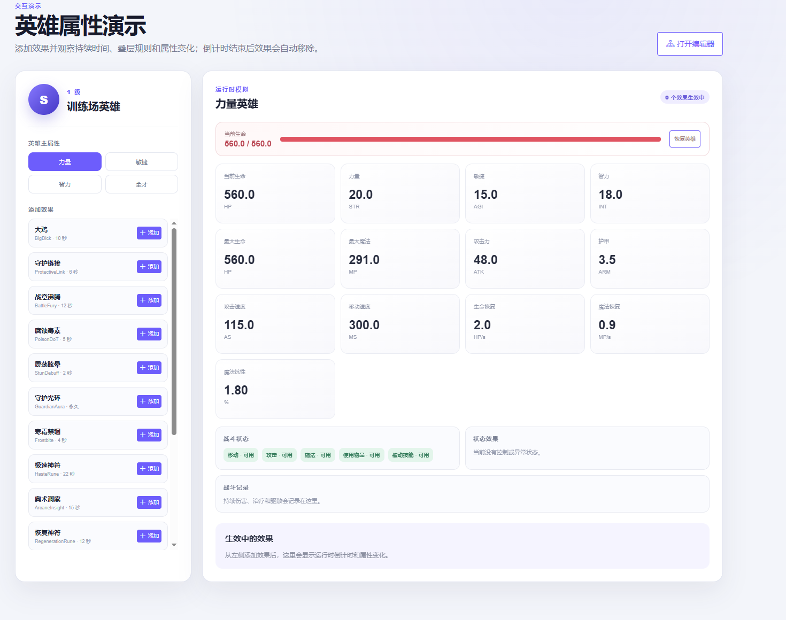
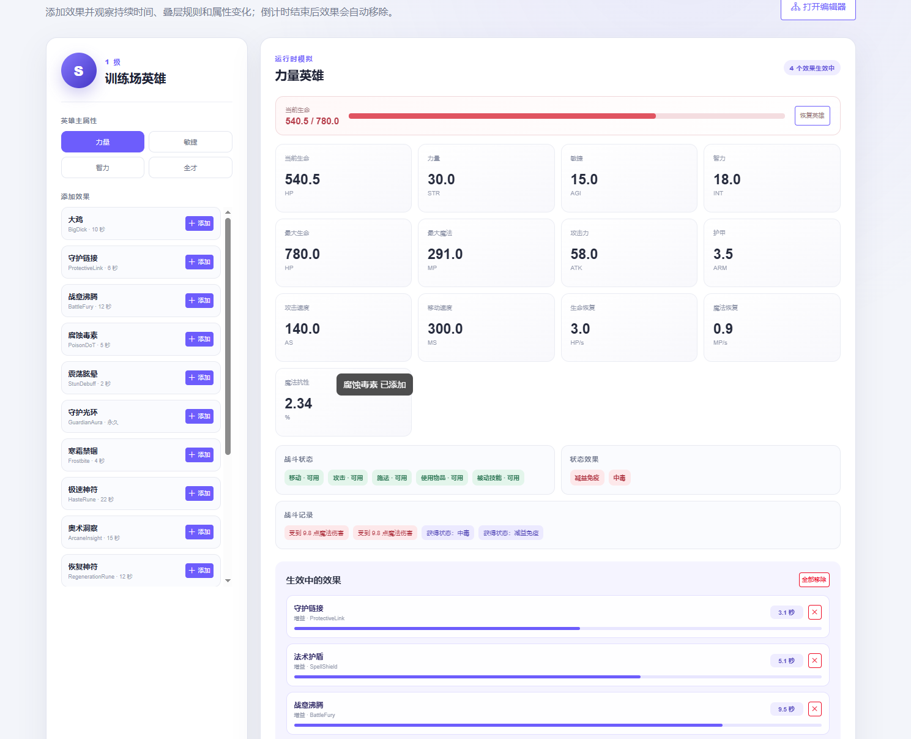
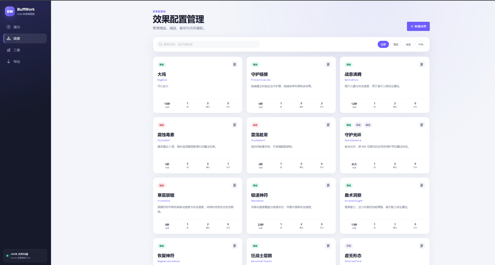
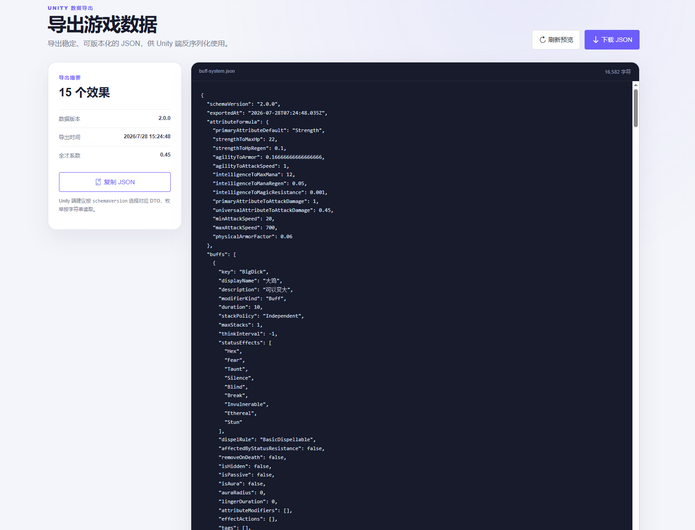
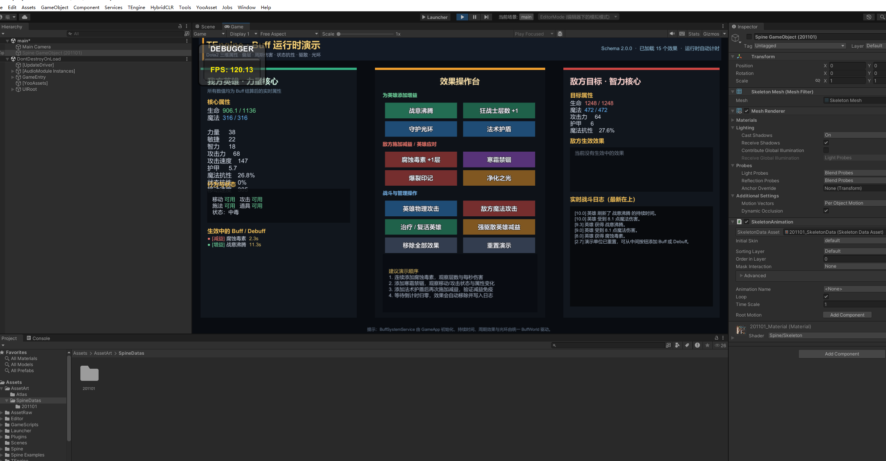

# Buff System Editors

面向 Unity 和 TEngine 项目的 Buff 配置、运行与演示仓库。项目由 Web 配置编辑器和 Unity Buff 运行时两部分组成，使策划配置、数据保存、JSON 导出、Unity 加载和战斗效果验证形成一套完整流程。

## 仓库作用

- 在浏览器中创建和维护 Buff、Debuff、被动效果与光环配置。
- 配置 Dota2 风格的力量、敏捷、智力及派生属性计算规则。
- 保存配置并导出统一的 Unity JSON 数据。
- 在 TEngine Unity 项目中加载配置，运行持续时间、叠层、周期效果、驱散、状态抗性和属性修改逻辑。
- 通过 Web 演示页和 Unity 演示面板快速验证 Buff 的实际效果。

## 目录结构

```text
BuffWork_Web/
├─ BuffWebEditor/                 Web 配置编辑器
│  ├─ apps/web/                   Vue 3 前端与演示页面
│  ├─ apps/api/                   NestJS 配置保存和导出服务
│  ├─ data/                       本地持久化配置数据
│  └─ docker-compose.yml          Docker 部署配置
└─ BuffUnityEditor/               Unity 与 TEngine 工程
   ├─ UnityProject/               可直接使用 Unity 打开的项目
   │  ├─ Assets/GameScripts/      Buff 运行时和 BuffDemoUI
   │  ├─ Assets/AssetRaw/         Buff JSON、场景和 UI 资源
   │  └─ Assets/Tests/            Buff 系统 EditMode 测试
   ├─ Configs/                    Luban 配置相关内容
   ├─ Tools/                      TEngine 配套工具
   └─ Books/                      TEngine 使用文档
```

## 数据流程

```text
Web 编辑 Buff -> NestJS 保存配置 -> 导出 Unity JSON -> Unity 加载配置 -> BuffDemoUI 运行验证
```

## 功能预览

### Web 英雄属性演示

展示 Dota2 风格的力量、敏捷、智力及派生属性，Buff 持续时间结束后会自动移除。



### Buff 运行效果

实时查看多个 Buff 和 Debuff 生效后的生命、攻击速度、状态效果、战斗记录与剩余时间。



### Buff 配置管理

集中管理增益、减益、被动和光环效果，支持搜索、分类筛选、新建、复制和编辑。



### Unity 数据导出

预览并下载带版本号的 JSON 配置，供 Unity 端按照统一数据结构反序列化使用。



### TEngine Unity 演示面板

在 Unity 中验证 Buff 叠层、持续时间、周期伤害、属性变化、驱散与战斗日志。



## 技术栈

- Web 前端：Vue 3、TypeScript、Vant 4、Pinia
- Web 服务端：Node.js、NestJS、TypeScript
- Unity：TEngine、C#、Unity 2021.3
- 部署：Docker、Docker Compose

## 在线访问

- Buff Web 编辑器：http://117.72.150.120:8082

详细的 Web 开发和部署说明请查看 [`BuffWebEditor/README.md`](BuffWebEditor/README.md)。Unity 工程说明请查看 [`BuffUnityEditor/README.md`](BuffUnityEditor/README.md)。
